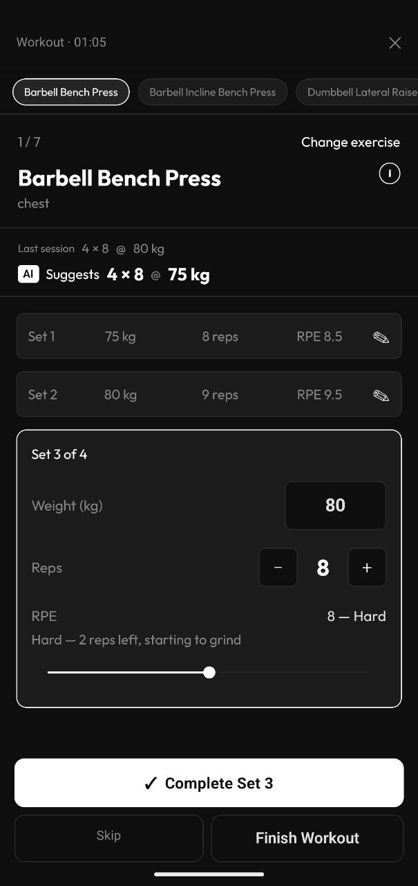
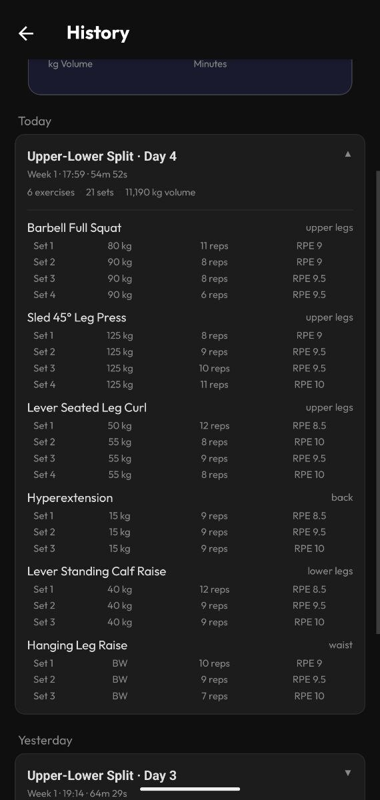
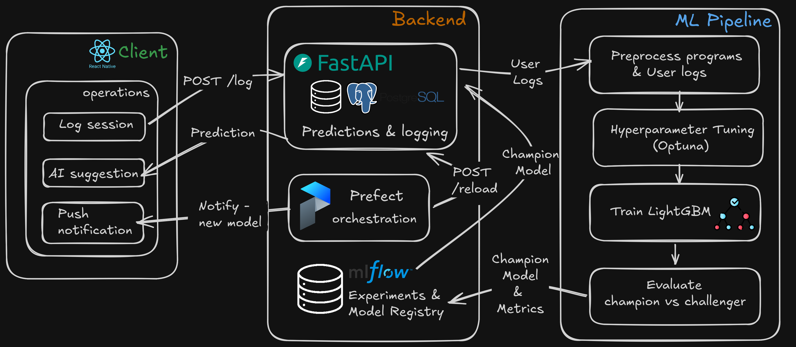

# Overload

A mobile-first workout progression app. You log your sessions; a LightGBM model trained on 200k+ prescriptions from 2,500+ coach-designed programs recommends what to lift next week — and gets smarter from your own logs over time.

 

---

## The problem

Progressive overload — gradually increasing training stress over time — is the fundamental driver of strength and muscle gains. Knowing *how much* to increase each week is non-trivial: too little and you stagnate, too much and you risk injury or burnout.

Existing apps either follow rigid pre-written programs or leave the decision entirely to the user. This project learns progression patterns from hundreds of real coach-designed programs, then continuously refines that knowledge from your own gym sessions.

---

## How it works

### Cold start — Boostcamp dataset

The model is bootstrapped on ~200k rows of structured workout program data (Boostcamp, via Kaggle), covering 2,500+ programs and 484 exercises. Each row is one exercise prescription: sets, reps, and intensity for a given week of a program.

**Dataset:** [600K+ Fitness Exercise & Workout Program Dataset](https://www.kaggle.com/datasets/adnanelouardi/600k-fitness-exercise-and-workout-program-dataset) — download `programs_detailed_boostcamp_kaggle.csv` and save it as `backend/data/programs_detailed_canonical.csv`.

### Continuous learning — user logs

Every session logged through the app is stored in PostgreSQL. When enough new sessions accumulate (configurable threshold), a Prefect flow retrains the model on the combined dataset. The new model is only promoted to production if it beats the current champion on a held-out validation set.

---

## Key concepts

### RPE — Rate of Perceived Exertion

RPE is a 6–10 scale describing how hard a set was in terms of reps left in reserve:

| RPE | Meaning |
|-----|---------|
| 10  | Maximum — could not do another rep |
| 9   | 1 rep left in reserve |
| 8   | 2 reps left in reserve |
| 7   | 3 reps left in reserve |
| 6   | 4+ reps left in reserve |

### pct_1rm — Percentage of One Rep Max

Your **1RM** is the maximum weight you can lift for a single rep. `pct_1rm` is your working weight as a fraction of that max.

RPE and pct_1rm are directly related via the Tuchscherer table — if you do 5 reps at RPE 8, you were lifting approximately 76% of your 1RM regardless of your absolute strength:

| Reps | RPE 7 | RPE 8 | RPE 9 | RPE 10 |
|------|-------|-------|-------|--------|
| 1    | 83%   | 88%   | 94%   | 100%   |
| 3    | 77%   | 82%   | 88%   | 94%    |
| 5    | 71%   | 76%   | 82%   | 88%    |
| 8    | 63%   | 68%   | 74%   | 79%    |
| 10   | 59%   | 65%   | 71%   | 77%    |
| 12   | 53%   | 58%   | 63%   | 68%    |

### What the model predicts

Week-over-week deltas in relative terms:

```
Input:  exercise, week position, lag performance (3 sessions back),
        trend features, periodization style, level, goal, equipment
Output: Δreps, Δpct_1rm
```

The absolute weight for next week is derived by multiplying the predicted `pct_1rm` by the user's estimated 1RM:

```
next_weight_kg = round((lag_pct_1rm + Δpct_1rm) × estimated_1rm, 2.5kg)
estimated_1rm  = weight / pct_1rm(reps, rpe)   ← Tuchscherer table
```

The Epley formula (`weight × (1 + reps/30)`) is only used to rank sets within a session when identifying the "best" set — it is not used for prediction. Tuchscherer keeps the 1RM estimate consistent with `lag_pct_1rm`, which is also derived from the same table.

---

## Architecture



### Retraining pipeline

```
User logs session via mobile app
        │
        ▼
PostgreSQL (session store)
        │
        ▼  threshold reached (every N sessions)
Prefect retraining_pipeline
        │
        ├─ 1. Preprocess    Merge Boostcamp + user logs → feature engineering
        ├─ 2. Train         LightGBM multi-output regression, logged to MLflow
        ├─ 3. Evaluate      Challenger vs current Production champion
        └─ 4. Promote       Best model tagged Production in MLflow Registry
                            FastAPI hot-swaps via /reload
```

### Services

| Service | Tool | Purpose |
|---------|------|---------|
| Experiment tracking | MLflow | Log params, metrics, model artifacts |
| Orchestration | Prefect | Retraining flows + scheduling |
| Session store | PostgreSQL | Persist user gym logs |
| API | FastAPI + Pydantic | Predictions, logging, model reload |
| Containerisation | Docker Compose | Full stack, single command |
| Mobile app | React Native + Expo | iOS/Android client |

---

## API

```
POST /predict            Get next week's prescription
POST /log                Record a completed session (feeds retraining)
GET  /exercises          List all known exercises
GET  /exercise-info      Exercise description, step-by-step instructions, image and GIF URLs
GET  /media/{path}       Static serving of exercise images and GIFs
GET  /health             Model status + version
POST /reload             Hot-swap to latest Production model
GET  /docs               Interactive Swagger UI
```

### Example

```json
POST /predict
{
  "exercise": "Barbell Bench Press",
  "one_rm": 100,
  "lag_sets": 3, "lag_reps": 5, "lag_rpe": 8,
  "lag2_reps": 5, "lag2_rpe": 7.5,
  "lag3_reps": 4, "lag3_rpe": 8,
  "week": 4, "program_length": 12,
  "day": 1, "time_per_workout": 60, "number_of_exercises": 4,
  "is_deload": 0, "overload_linear": 1,
  "level_Intermediate": 1, "goal_powerbuilding": 1, "equipment_full_gym": 1
}

→ { "delta_reps": 1.0, "delta_pct_1rm": 0.03, "next_reps": 6, "next_weight_kg": 82.5 }
```

Exercise names are matched case-insensitively against the exercise map.

---

## Exercise data

The app uses 484 canonical exercises sourced from the ExerciseDB dataset. Only exercises that appear in the Boostcamp training data are included. The exercise list is bundled statically in the mobile app — no network request needed for search.

The full ExerciseDB dataset (`backend/data/exercises_dataset/`) provides per-exercise descriptions, step-by-step instructions, a static image, and an animated GIF for each movement. These are served at runtime via FastAPI's `StaticFiles` mount (`GET /media/...`). The `api` service mounts `./data` as a volume so the files are never baked into the Docker image.

---

## Project structure

```
overload/
├── backend/
│   ├── data/
│   │   ├── programs_detailed_canonical.csv  # Boostcamp dataset (not committed)
│   │   ├── exercise_map.json                # Canonical exercise name → integer ID
│   │   ├── exercises_dataset/               # ExerciseDB — descriptions, images, GIFs (not committed)
│   │   │   ├── data/exercises.json
│   │   │   ├── images/
│   │   │   └── videos/
│   │   ├── map_exercises.py                 # Maps messy training names → canonical names
│   │   └── generate_frontend_exercises.py
│   ├── src/
│   │   ├── data/
│   │   │   ├── consts.py                    # Tuchscherer RPE → pct_1rm table
│   │   │   └── preprocess.py               # Cleaning + feature engineering
│   │   ├── models/
│   │   │   ├── train.py                     # MLflow training run + DEFAULT_HYPERPARAMS
│   │   │   ├── tune.py                      # Optuna hyperparameter search
│   │   │   ├── evaluate.py                  # Champion vs challenger promotion
│   │   │   ├── quick_eval.py                # Local eval without MLflow
│   │   │   └── utils.py                     # Model loading helpers
│   │   ├── pipeline/
│   │   │   └── flow.py                      # Prefect retraining pipeline
│   │   └── api/
│   │       ├── app.py                       # FastAPI app
│   │       ├── schemas.py                   # Pydantic I/O models + feature column list
│   │       └── db.py                        # SQLAlchemy workout log model
│   ├── docker-compose.yml
│   ├── Dockerfile
│   ├── pyproject.toml
│   └── requirements.txt
└── frontend/
    ├── src/
    │   ├── api/
    │   │   └── client.ts                    # predict(), logWorkout(), flag helpers
    │   ├── data/
    │   │   └── exercises.json               # 484 canonical exercises (bundled)
    │   ├── screens/
    │   │   ├── HomeScreen.tsx
    │   │   ├── AddProgramModal.tsx          # Program creation (6-step wizard)
    │   │   ├── ActiveWorkoutScreen.tsx      # Live workout + AI suggestion display
    │   │   ├── WorkoutCompleteScreen.tsx    # Summary + session logging
    │   │   └── WorkoutHistoryScreen.tsx
    │   ├── types.ts
    │   └── theme.ts
    ├── App.tsx
    └── package.json
```

---

## Quickstart

### 1. Backend

```bash
# Copy and fill in environment variables
cp backend/.env.example backend/.env

# Download the dataset → backend/data/programs_detailed_canonical.csv

# Start all services
cd backend && docker compose up -d

# Run the training pipeline (preprocess → tune → train → evaluate → promote)
# This takes a few minutes on first run
docker compose exec worker python -m src.pipeline.flow
```

| UI | URL |
|----|-----|
| MLflow | http://localhost:5001 |
| Prefect | http://localhost:4200 |
| API docs | http://localhost:8000/docs |

### 2. Mobile app

```bash
cp frontend/.env.example frontend/.env
# Edit frontend/.env with your backend URL and API key
```

The app needs to reach the backend from your phone. Options:

- **USB (recommended):** `adb reverse tcp:8000 tcp:8000` then set `EXPO_PUBLIC_API_URL=http://localhost:8000`
- **ngrok:** `ngrok http 8000` then use the printed `https://` URL
- **LAN IP:** use your machine's IP (e.g. `http://192.168.1.x:8000`) — may be blocked by AP isolation on some routers

```bash
cd frontend && npx expo start
```

> **Push notifications** require a development or preview build — they are not supported in Expo Go since SDK 53. Run `eas build --profile development --platform android` for a dev build that supports all features.

---

## Roadmap

- [x] Boostcamp cold-start training pipeline
- [x] MLflow experiment tracking + model registry
- [x] Champion/challenger promotion logic
- [x] FastAPI prediction + logging endpoints
- [x] Prefect orchestration — retraining flow
- [x] PostgreSQL session store
- [x] React Native mobile app (Expo)
- [x] On-device workout history
- [x] AI prediction wired into active workout screen
- [x] Push notifications on retraining trigger
- [x] 3-session lag trend features (velocity + acceleration for reps and intensity)
- [x] Deload week detection + user-facing toggle
- [x] Periodization style classification (linear / undulating / block)
- [x] Optuna hyperparameter search